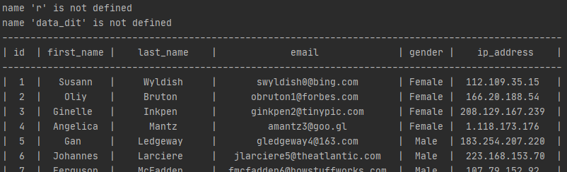

# Содержание
- [ЛР № 1–3](#лабораторная-работа--13)
- [ИСР № 1](#инвариативная-самостоятельная-работа--1)
    - [1 задание](#11-разработка-программы-для-считывания-данных-из-json-файла-и-их-вывода-в-табличном-виде-с-использованием-исключений)
    - [2 задание](#12-дополнение-программы-дял-считывания-данных-проверкой-высказываний-assert)
    - [3 задание]
- [ВСР № 1](#вариативная-самостоятельная-работа--1)

# [Лабораторная работа № 1–3](https://repl.it/@Rakleed/programming4-lab1-3)
```python
import sqlite3


conn = sqlite3.connect("example.db")
c = conn.cursor()


def insert():
    values = [("2020-02-20", "BUY", "APL", 100, 42.00)]
    try:
        c.executemany(f'INSERT INTO stocks VALUES (?, ?, ?, ?, ?)', values)
        conn.commit()
    except sqlite3.Error as error:
        print("Не получилось обновить таблицу ", error)


def update():
    price = 10.4
    symbol = "APL"
    try:
        c.execute('UPDATE stocks SET price = ? WHERE symbol = ?', (price, symbol))
        conn.commit()
    except sqlite3.Error as error:
        print("Не получилось обновить таблицу", error)
    

def delete():
    try:
        c.execute("DELETE FROM stocks WHERE price = 56.0")
        conn.commit()
    except sqlite3.Error as error:
        print("Не получилось обновить таблицу ", error)


def main():
    print("Хотите просто увидеть содержимое таблицы? (Y/N)")
    answer = input()
    if answer == "n":
        insert()
        update()
        delete()
    if answer == "y":
        for row in c.execute('SELECT * FROM stocks ORDER BY price'):
            print(row)
    if answer != "y" and answer != "n":
        print("Вы ввели неверные данные.")
    for row in c.execute('SELECT * FROM stocks ORDER BY price'):
            print(row)
    

main()
conn.close()
```
[example.db](src/example.db)


# Инвариативная самостоятельная работа № 1
### [1.1. Разработка программы для считывания данных из JSON-файла и их вывода в табличном виде с использованием исключений.](https://repl.it/@Rakleed/programming4-indepworkinvar1-1)
```python
"""
    Автор: Моисеенко Павел, группа № 1, подгруппа № 2.

    ИСР 1.1. Задание: разработать программу с реализацией функции для 
    считывания json-данных из файла и вывод их в табличном виде на 
    экран. Реализовать базовый синтаксис для обработки исключений 
    (try..except).

"""

import json

try:
    with open('file.json') as f:
        data_dict = json.load(f)
except FileNotFoundError as e:
    print(e)

try:
    with open('file.json') as f:
        data_dict = json.load(r)
except NameError as e:
    print(e)

try:
    for element in range(len(data_dict)):
        temp = data_dit[element]
        res = string.format(**temp)
        table.append(res)
except NameError as e:
    print(e)


def json_table(file):
    with open(file) as f:
        data_dict = json.load(f)
    table = []
    string = '| {id:^3} | {first_name:^10} | {last_name:^15} | {email:^30} | {gender:^6} | {ip_address:^16} |'
    t_caption = '| {:^3} | {:^10} | {:^15} | {:^30} | {:^6} | {:^16} |'.format('id', 'first_name', 'last_name', 'email',
                                                                               'gender', 'ip_address')
    header = '-' * len(t_caption)
    table.append(header)
    table.append(t_caption)
    table.append(header)
    for el in range(len(data_dict)):
        temp = data_dict[el]
        res = string.format(**temp)
        table.append(res)
    table.append(header)
    return table


def main():
    a = json_table('file.json')
    for element in a:
        print(element)


main()
```
[file.json](src/file.json)



### [1.2. Дополнение программы дял считывания данных проверкой высказываний (assert).](https://repl.it/@Rakleed/programming4-indepworkinvar1-2)
```python
"""
    Автор: Моисеенко Павел, группа № 1, подгруппа № 2.

    ИСР 1.2. Задание: дополнить программу для считывания данных
    проверкой утверждений или высказываний (assert). Создать отдель-
    ный блок для такой проверки (с помощью __name__) и скрипт
    командной строки для запуска этих проверок.

"""

import json


def json_table(file):
    with open(file) as f:
        data_dict = json.load(f)

    table = []
    string = '| {id:^3} | {first_name:^10} | {last_name:^15} | {email:^30} | {gender:^6} | {ip_address:^16} |'
    t_caption = '| {:^3} | {:^10} | {:^15} | {:^30} | {:^6} | {:^16} |'.format('id', 'first_name', 'last_name', 'email',
                                                                               'gender', 'ip_address')
    header = '-' * len(t_caption)

    table.append(header)
    table.append(t_caption)
    table.append(header)

    for el in range(len(data_dict)):
        temp = data_dict[el]
        res = string.format(**temp)
        table.append(res)
    table.append(header)

    return table


def main():
    a = json_table('file.json')
    print(type(a))
    for element in a:
        print(element)


if __name__ == "__main__":
    assert type(json_table('file.json')) == list, "Типы не совпадают."
    assert type(json_table('file.json')) != tuple

main()
```
[file.json](src/file.json)


### [1.3. Дополнить программу для считывания данных с использованием менеджера контекстов и реализацией расширенного синтаксиса для обработки исключений.](https://repl.it/@Rakleed/programming4-indepworkinvar1-3)
```python
"""
    Автор: Моисеенко Павел, группа № 1, подгруппа № 2.

    ИСР 1.3. Задание: дополнить программу для считывания данных с 
    использованием менеджера контекстов и реализацией расширенного 
    синтаксиса для обработки исключений.

"""

import json

try:
    with open("file.json") as f:
        data_dict = json.load(f)
except FileNotFoundError as e:
    print(e)

try:
    with open("file.json") as f:
        data_dict = json.load(r)
except NameError as e:
    print(e)

try:
    for el in range(len(data_dict)):
        temp = data_dit[el]
        res = string.format(**temp)
        table.append(res)
except NameError as e:
    print(e)
else:
    print("Congratulations! Your program work right.")
finally:
    print("It is impossible to learn anything without mistakes.")


def json_table(fl):
    with open(fl) as f:
        data_dict = json.load(f)

    table = []
    string = '| {id:^3} | {first_name:^10} | {last_name:^15} | {email:^30} | {gender:^6} | {ip_address:^16} |'
    t_caption = '| {:^3} | {:^10} | {:^15} | {:^30} | {:^6} | {:^16} |'.format('id', 'first_name', 'last_name', 'email',
                                                                               'gender', 'ip_address')
    header = '-' * len(t_caption)

    table.append(header)
    table.append(t_caption)
    table.append(header)

    for element in range(len(data_dict)):
        temp = data_dict[element]
        res = string.format(**temp)
        table.append(res)
    table.append(header)

    return table


def main():
    a = json_table('file.json')
    for element in a:
        print(element)


main()
```
[file.json](src/file.json)


# [Вариативная самостоятельная работа № 1](https://repl.it/@Rakleed/programming4-indepworkvar1)
```python

```

